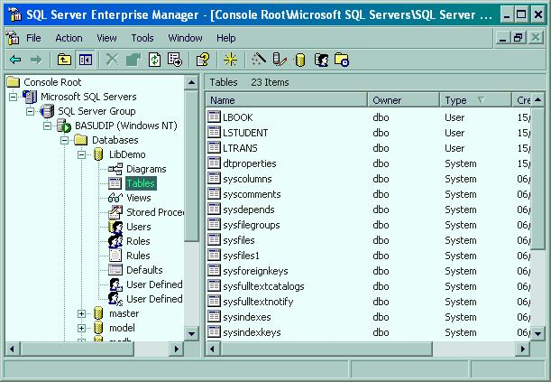



## Easy LibraryManagementSystem

### Description

A Library Management System using Microsoft SQL Server database in the

backend. This project can also be implemented on Oracle by only

changing the ADODB.ConnectionString property. Before working on the project

you need to create the normalised tables, I've provided with the (DDL)

SQL commands to adumbrate you with the structures for the tables used in

the project. My Local Server name is BasuDip you'll need to modify this

in the code. A screenshot of SQL Server Enterprise Manager is provided

for reference. An updated code on Calculator is also included with the project.

Hope you like it, your inspiration is solicited. Please vote and/or post your comments.
 
### More Info
 

             |
---                |---
**Submitted On**   |2006-05-29 22:34:24
**By**             |[Dipankar Basu](https://github.com/Planet-Source-Code/PSCIndex/blob/master/ByAuthor/dipankar-basu.md)
**Level**          |Beginner
**User Rating**    |4.3 (13 globes from 3 users)
**Compatibility**  |VB 5\.0, VB 6\.0
**Category**       |[Databases/ Data Access/ DAO/ ADO](https://github.com/Planet-Source-Code/PSCIndex/blob/master/ByCategory/databases-data-access-dao-ado__1-6.md)
**World**          |[Visual Basic](https://github.com/Planet-Source-Code/PSCIndex/blob/master/ByWorld/visual-basic.md)
**Archive File**   |[Easy\_Libra199896662006\.zip](https://github.com/Planet-Source-Code/dipankar-basu-easy-librarymanagementsystem__1-65575/archive/master.zip)

